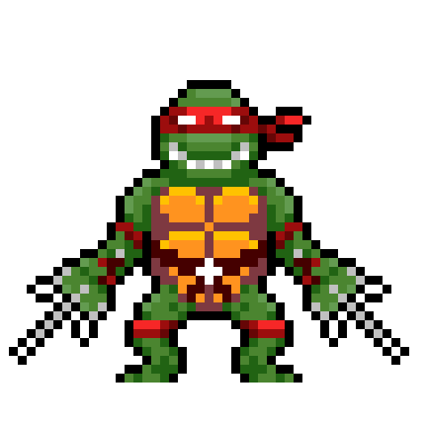

<h1>Moses Uadia</h1>

<samp>Building intelligent solutions for engineering with Machine Learning & Data Science.</samp>

 

  
  
  
  
  

---

<h2 id="about">About</h2>

I am a Petroleum Engineer focused on applying data analytics and machine learning to analyse, predict, and optimise oil and gas well performance. My interests lie in intelligent well engineering, where data-driven methods improve production forecasting, diagnose well behaviour, and support engineering decision-making.

<h3>Research Interests</h3>

  Intelligent Well Engineering • Production Forecasting • Reservoir Analytics • Machine Learning • Data Science • Scientific Computing

---

<h2 id="technologies-i-work-with" align="center">Technologies I Work With</h2>

<strong>Programming</strong>

  

<strong>Machine Learning</strong>

  

<strong>Data Science</strong>

  

<strong>Cloud</strong>

  

<strong>Development</strong>

  

<strong>Design</strong>

  

---

<h2 id="selected-work">Selected Work</h2>

### 🌍 Africa Geothermal Datathon 2026

Machine learning and data-driven analysis for geothermal resource assessment, energy planning, and engineering decision-making.

<a href="https://github.com/Daya-py/africa-geothermal-datathon-2026">View Repository →</a>

 

### 📚 Academic Research OS

An open-source framework for structuring, managing, and streamlining academic research, from proposal development to thesis writing.

<a href="https://github.com/Daya-py/Academic-Research-OS">View Repository →</a>

---

<h2 id="github-analytics">GitHub Analytics</h2>

  

  

---

<h2 id="connect" align="center">Let's Connect</h2>

  
  
  

